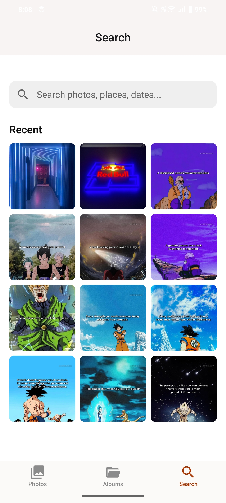

# Memories

A simple gallery app built for learning purposes. This project serves as a hands-on experience to explore mobile app development.

## Screenshots

  
  
  

## Project Goals

- Learn the fundamentals of application development.
- Work with local file systems and media assets.
- Understand UI design, navigation, and state management.

## Features (Planned)

- View a grid of images.
- Full-screen image viewing.
- Basic image organization and management.
