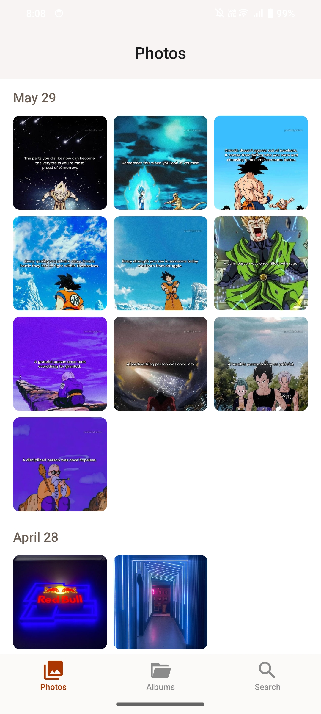
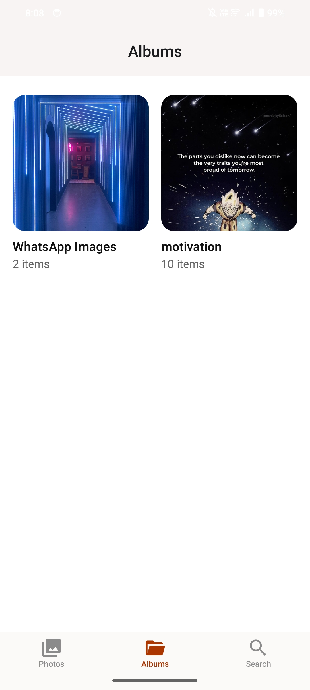

# Memories

A simple gallery app built for learning purposes. This project serves as a hands-on experience to explore mobile app development.

## Screenshots

  
  

## Features

- View a grid of images.
- Full-screen image viewing.
- Basic image organization and management.
- Image share, delete, info
